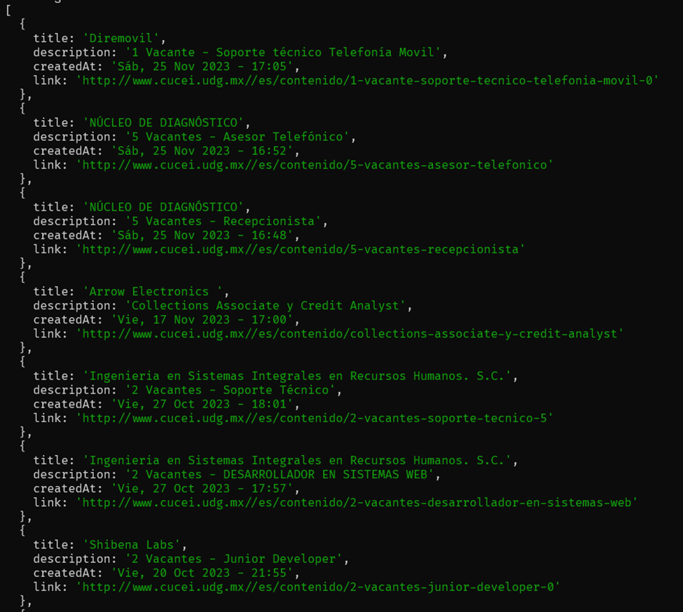
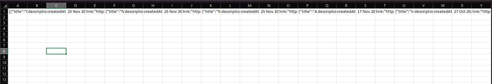

# Cucei Scraper JS

## Tecnologías utilizadas:
• Node.js
• JavaScript

## Librerías de JavaScript utilizadas:
• Axios
• Cheerio
• Fs

## Link del proyecto en GitHub:
https://github.com/zekt1209/CUCEI-Scraper-JS

## Funcionamiento:
Este web scraper hace una petición de tipo GET a la página de la bolsa de trabajo para licenciatura en
informática que publica CUCEI al público general, donde publica vacantes de trabajo, el web scraper se
trae el HTML de dicha pagina y con la librería cheerio, hago un poco de manipulación del DOM para
extraer solo la información de las vacantes que necesitamos (Titulo de la vacante, descripción, fecha de
publicación, link para consultar mas detalles de la vacante)
http://www.cucei.udg.mx/servicios/bolsa-de-trabajo/licenciatura-en-ingenieria-informatica

Y posteriormente, mediante un script en escrito en JS, manipulamos la información obtenida y la
guardamos en un arreglo de objetos, quedándonos de esta manera:

Al final conseguí que cada que se ejecute este script, se genere un archivo CSV con la información
obtenida, aunque el formato no es el mas estético, sigo trabajando en darle formato a la información
que se ingresa al archivo CSV

## Conclusión
Los web scrapers son una herramienta construida por los desarrolladores que se puede dedicar a facilitar
o eficientar las tareas cotidianas que son muy repetitivas, hay una gran variedad de posibilidades de
lograr eficientar un tarea que involucre datos que están en la web con estas herramientas, a veces puede
sonar complicado, pero construirlo paso a paso y dividiendo las tareas para lograrlo nos llevara a que el
programa sea más fácil de construir.